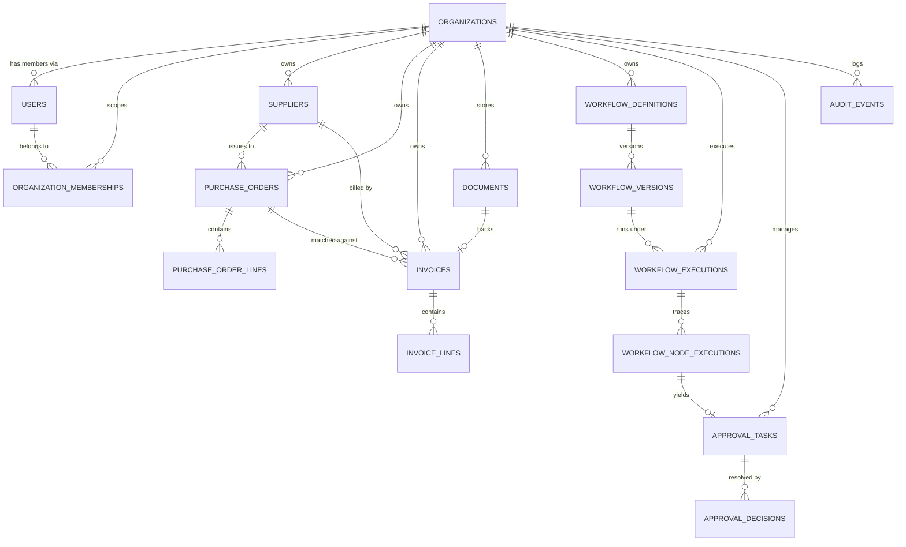

# Database Entity Relationships (ERD)

```mermaid
erDiagram
    ORGANIZATIONS ||--o{ USERS : "has members via"
    ORGANIZATIONS ||--o{ ORGANIZATION_MEMBERSHIPS : "scopes"
    USERS ||--o{ ORGANIZATION_MEMBERSHIPS : "belongs to"
    ORGANIZATIONS ||--o{ SUPPLIERS : "owns"
    ORGANIZATIONS ||--o{ PURCHASE_ORDERS : "owns"
    ORGANIZATIONS ||--o{ INVOICES : "owns"
    ORGANIZATIONS ||--o{ DOCUMENTS : "stores"
    ORGANIZATIONS ||--o{ WORKFLOW_DEFINITIONS : "owns"
    ORGANIZATIONS ||--o{ WORKFLOW_EXECUTIONS : "executes"
    ORGANIZATIONS ||--o{ APPROVAL_TASKS : "manages"
    ORGANIZATIONS ||--o{ AUDIT_EVENTS : "logs"

    PURCHASE_ORDERS ||--o{ PURCHASE_ORDER_LINES : "contains"
    SUPPLIERS ||--o{ PURCHASE_ORDERS : "issues to"
    SUPPLIERS ||--o{ INVOICES : "billed by"
    PURCHASE_ORDERS ||--o{ INVOICES : "matched against"
    INVOICES ||--o{ INVOICE_LINES : "contains"
    DOCUMENTS ||--o| INVOICES : "backs"

    WORKFLOW_DEFINITIONS ||--o{ WORKFLOW_VERSIONS : "versions"
    WORKFLOW_VERSIONS ||--o{ WORKFLOW_EXECUTIONS : "runs under"
    WORKFLOW_EXECUTIONS ||--o{ WORKFLOW_NODE_EXECUTIONS : "traces"
    WORKFLOW_NODE_EXECUTIONS ||--o| APPROVAL_TASKS : "yields"
    APPROVAL_TASKS ||--o{ APPROVAL_DECISIONS : "resolved by"
```
