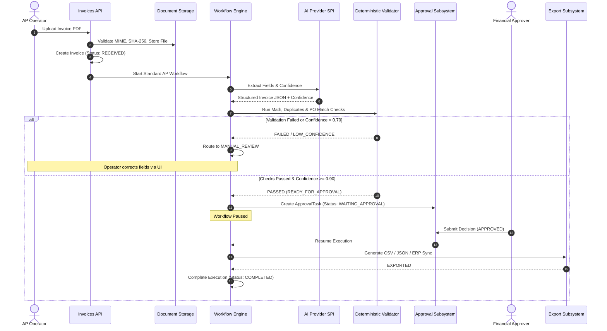

# Invoice Processing Lifecycle Flow

```mermaid
sequenceDiagram
    autonumber
    actor Operator as AP Operator
    participant API as Invoices API
    participant Doc as Document Storage
    participant WF as Workflow Engine
    participant AI as AI Provider SPI
    participant Val as Deterministic Validator
    participant Appr as Approval Subsystem
    actor Approver as Financial Approver
    participant Export as Export Subsystem

    Operator->>API: Upload Invoice PDF
    API->>Doc: Validate MIME, SHA-256, Store File
    API->>API: Create Invoice (Status: RECEIVED)
    API->>WF: Start Standard AP Workflow
    WF->>AI: Extract Fields & Confidence
    AI-->>WF: Structured Invoice JSON + Confidence
    WF->>Val: Run Math, Duplicates & PO Match Checks
    alt Validation Failed or Confidence < 0.70
        Val-->>WF: FAILED / LOW_CONFIDENCE
        WF->>WF: Route to MANUAL_REVIEW
        Note over Operator, WF: Operator corrects fields via UI
    else Checks Passed & Confidence >= 0.90
        Val-->>WF: PASSED (READY_FOR_APPROVAL)
        WF->>Appr: Create ApprovalTask (Status: WAITING_APPROVAL)
        Note over WF: Workflow Paused
        Approver->>Appr: Submit Decision (APPROVED)
        Appr->>WF: Resume Execution
        WF->>Export: Generate CSV / JSON / ERP Sync
        Export-->>WF: EXPORTED
        WF->>WF: Complete Execution (Status: COMPLETED)
    end
```
