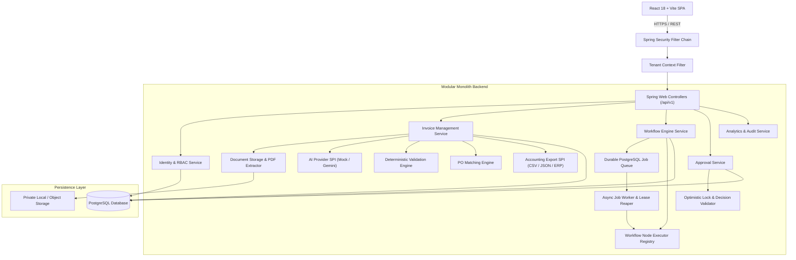

# System Architecture Diagram

```mermaid
graph TD
    Client["React 18 + Vite SPA"] -->|HTTPS / REST| Gate["Spring Security Filter Chain"]
    Gate --> Tenant["Tenant Context Filter"]
    Tenant --> Controller["Spring Web Controllers (/api/v1)"]
    
    subgraph Modular Monolith Backend
        Controller --> AuthService["Identity & RBAC Service"]
        Controller --> InvoiceService["Invoice Management Service"]
        Controller --> WorkflowService["Workflow Engine Service"]
        Controller --> ApprovalService["Approval Service"]
        Controller --> AnalyticsService["Analytics & Audit Service"]
        
        InvoiceService --> DocStorage["Document Storage & PDF Extractor"]
        InvoiceService --> AIProvider["AI Provider SPI (Mock / Gemini)"]
        InvoiceService --> ValidationEngine["Deterministic Validation Engine"]
        InvoiceService --> POMatching["PO Matching Engine"]
        
        WorkflowService --> JobQueue["Durable PostgreSQL Job Queue"]
        WorkflowService --> NodeRegistry["Workflow Node Executor Registry"]
        JobQueue --> Worker["Async Job Worker & Lease Reaper"]
        Worker --> NodeRegistry
        
        ApprovalService --> ConcurrencyLock["Optimistic Lock & Decision Validator"]
        InvoiceService --> ExportSPI["Accounting Export SPI (CSV / JSON / ERP)"]
    end
    
    subgraph Persistence Layer
        AuthService --> DB[("PostgreSQL Database")]
        InvoiceService --> DB
        WorkflowService --> DB
        ApprovalService --> DB
        DocStorage --> FS["Private Local / Object Storage"]
    end
```
