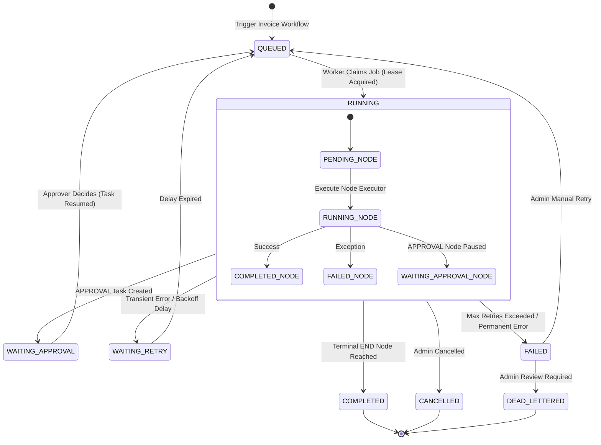

# Workflow Execution & Node State Machine

```mermaid
stateDiagram-v2
    [*] --> QUEUED : Trigger Invoice Workflow
    QUEUED --> RUNNING : Worker Claims Job (Lease Acquired)
    
    state RUNNING {
        [*] --> PENDING_NODE
        PENDING_NODE --> RUNNING_NODE : Execute Node Executor
        RUNNING_NODE --> COMPLETED_NODE : Success
        RUNNING_NODE --> FAILED_NODE : Exception
        RUNNING_NODE --> WAITING_APPROVAL_NODE : APPROVAL Node Paused
    }
    
    RUNNING --> WAITING_APPROVAL : APPROVAL Task Created
    WAITING_APPROVAL --> QUEUED : Approver Decides (Task Resumed)
    
    RUNNING --> WAITING_RETRY : Transient Error / Backoff Delay
    WAITING_RETRY --> QUEUED : Delay Expired
    
    RUNNING --> FAILED : Max Retries Exceeded / Permanent Error
    FAILED --> DEAD_LETTERED : Admin Review Required
    FAILED --> QUEUED : Admin Manual Retry
    
    RUNNING --> COMPLETED : Terminal END Node Reached
    RUNNING --> CANCELLED : Admin Cancelled
    
    COMPLETED --> [*]
    CANCELLED --> [*]
    DEAD_LETTERED --> [*]
```
